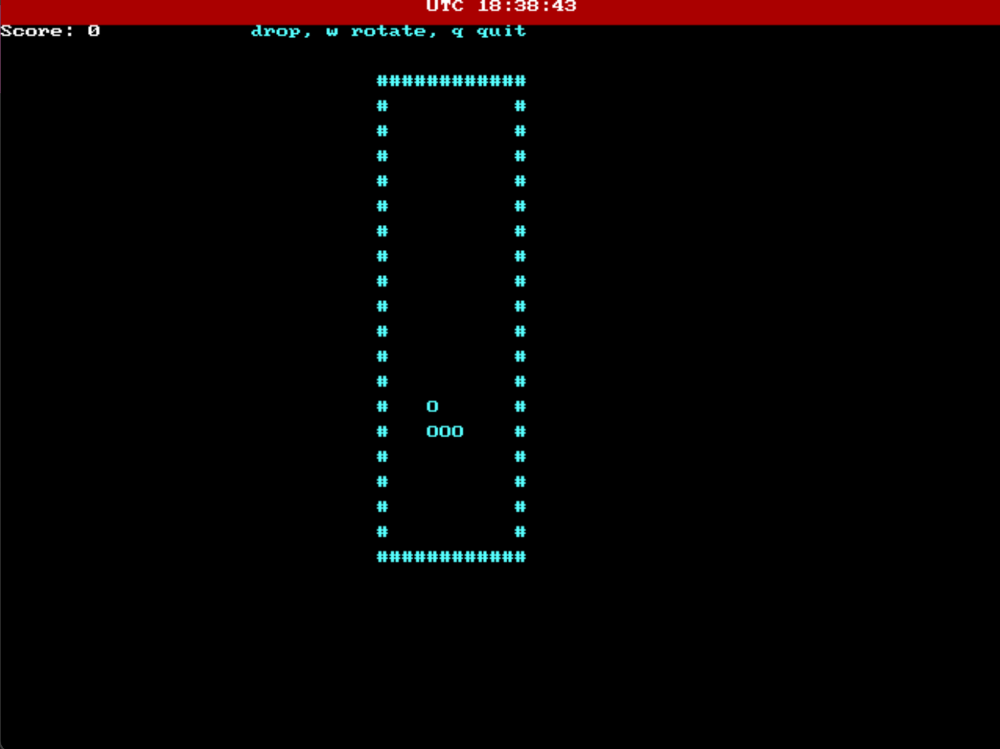
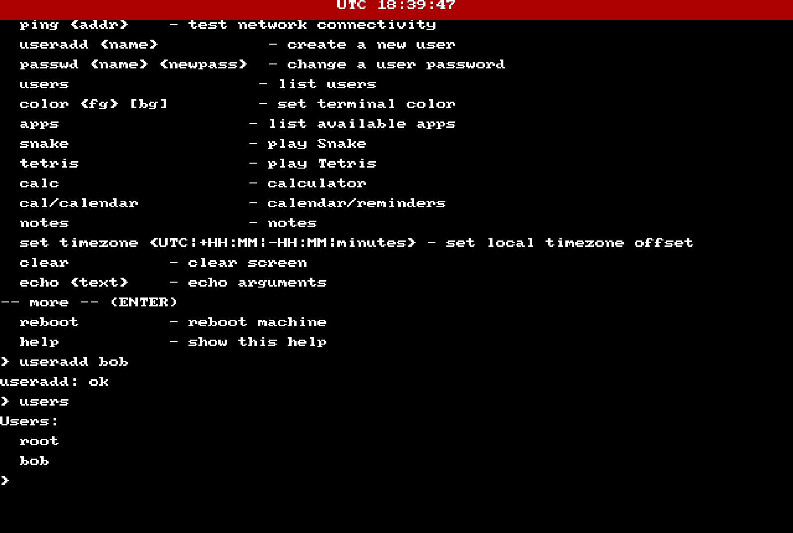

# Moniish95 OS
Scroll down for the google drive link

MoniishOS OS/Or MonolithicOS is a 64-bit monolithic hobby operating system
focused on a fast CLI-first experience.
This is a personal project I'm working on to learn more about operating systems and low-level programming.
This project is not meant to be used as a production operating system, but rather as a learning experience.
The goal of this project is to create a simple, fast, and reliable operating system that can run on modern hardware.
I will listen to feedback and suggestions to improve the project.
Made with C, C++, and Assembly.

## Features
- 64-bit x86_64 kernel
- Custom CLI shell
- Bash-inspired commands
- Framebuffer terminal
- Minimal system requirements

## Requirements
- x86_64 CPU 
- 128 MB RAM (minimum, recommended 256 MB)
- 32 MB disk minimum (formatted as FAT32)

## Status
Current version: 1.0.0

[Download Mono OS ISO](https://drive.google.com/file/d/1OFOwdJ9398btmMXYnoWwNXXsqdDXbEjx/view?usp=drive_link)

## Screenshots

